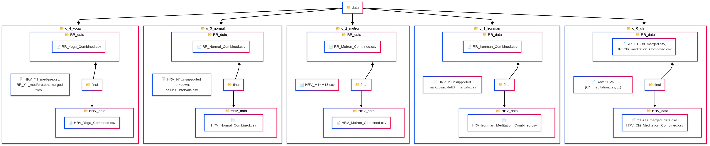
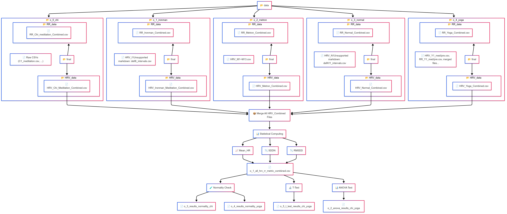

# HRV Comparison Across Meditation & Breathing Techniques 🧘‍♂️💓


## 📅 Project Overview

This project analyzes **Heart Rate Variability (HRV)** during various meditation and breathing states using the **PhysioNet HRV dataset**. We compare Chi meditation, Kundalini Yoga, sleep, and metronomic breathing based on time-domain HRV metrics and use **machine learning models** to distinguish between these states.

---


## 🎓 Learning Objectives

* Analyze HRV using time-domain features (Mean HR, SDNN, RMSSD)
* Compare meditation vs. sleep vs. breathing via statistical tests (t-test, ANOVA)
* Visualize physiological differences across states using box/violin plots
* Train ML classifiers (KNN, Random Forest) to classify states
* Interpret results and draw cardiovascular health insights

---

## 🧾 Dataset

**Source:** PhysioNet: [Heart Rate Oscillations During Meditation](https://physionet.org/content/meditation/1.0.0/)

### Groups

* **Chi Meditation:** C1–C8 (pre and med)
* **Kundalini Yoga:** Y1–Y4 (pre and med)
* **Normal Sleep:** N1–N11
* **Ironman :** I1-I9
* **Metronomic Breathing:** M1–M14

### Columns

* Elapsed Time (seconds)
* Instantaneous Heart Rate (bpm)

---

## 🗺️ Data Preprocessing Overview

The following diagrams illustrate the preprocessing steps used:

### 📌 Data Loading Structure


### 📌 Preprocessing Summary Flow



## 🧼 Sample Preprocessing Code

### 🔹 Load Raw Heart Rate Data

```python
# Define file paths
input_file = r"...\data\chi\C1.pre"
output_file = r"...\dataset\o_0_chi\C1_pre_meditation.csv"

# Load text data
df = pd.read_csv(input_file, sep="\s+", header=None, names=["Time", "HeartRate"])
df["Subject"] = "C1_pre"
df["Group"] = "Chi"
df["State"] = "Pre_Meditation"
df.to_csv(output_file, index=False)
```

### 🔹 Merge Pre/Post Meditation Data

```python
file_pre = r"...\C1_pre_meditation.csv"
file_med = r"...\C1_meditation.csv"

# Merge files
pre = pd.read_csv(file_pre)
med = pd.read_csv(file_med)
c1_merged = pd.concat([pre, med], ignore_index=True)
c1_merged.to_csv("...\C1_merged_data.csv", index=False)
```

### 🔹 Extract R-R Intervals (from `.qrs` files)

```python
import wfdb, numpy as np, pandas as pd

# Load QRS peaks
def load_qrs_peaks(path):
    annotation = wfdb.rdann(path, 'qrs')
    return annotation.sample

# Compute R-R intervals
r_peaks = load_qrs_peaks("...\C1pre")
time_stamps = r_peaks[1:] / 250
rr_intervals = np.diff(r_peaks) / 250

# Create DataFrame and save
rr_df = pd.DataFrame({"Time": time_stamps, "RR_Interval": rr_intervals})
rr_df["Subject"] = "C1_pre_rr"
rr_df["Group"] = "Chi Meditation"
rr_df["State"] = "Pre-Meditation"
rr_df.to_csv("...\RR_C1_pre.csv", index=False)
```

### 🔹 Combine All RR Intervals for Chi Group

```python
import glob

rr_files = glob.glob(r"...\RR_C*_merged.csv")
df_all_rr = pd.concat([pd.read_csv(f) for f in rr_files], ignore_index=True)
df_all_rr.to_csv(r"...\RR_Chi_meditation_Combined.csv", index=False)
```

---

## 🔬 Statistical Testing Code (ANOVA + T-test)

```python
from scipy.stats import ttest_rel, f_oneway, shapiro

# Paired T-Test (Chi pre vs. med)
t_stat, p_val = ttest_rel(df_chi_pre["RMSSD"], df_chi_med["RMSSD"])
print("T-test Chi RMSSD: t =", t_stat, "p =", p_val)

# ANOVA (across groups)
f_stat, p_val = f_oneway(df_chi["RMSSD"], df_yoga["RMSSD"], df_sleep["RMSSD"], df_metron["RMSSD"])
print("ANOVA RMSSD: F =", f_stat, "p =", p_val)

# Normality check
shapiro_stat, shapiro_p = shapiro(df_chi_pre["RMSSD"])
print("Shapiro-Wilk p =", shapiro_p)
```

---

## 🔄 Preprocessing Flowchart

```
📁 data/
├── 0_0_chi/
│   ├── RR_data/
│   │   └── RR_C1-C8_merged_data.csv, RR_Chi_meditation_Combined.csv
│   └── HRV_data/
│       └── C1-C8_merged_data.csv, HRV_Chi_Meditation_Combined.csv
├── 0_1_ironman/
│   ├── RR_data/
│   │   └── RR_Ironman_Combined.csv
│   └── HRV_data/
│       └── HRV_Ironman_Meditation_Combined.csv
├── 0_2_metron/
│   ├── RR_data/
│   │   └── RR_Metron_Combined.csv
│   └── HRV_data/
│       └── HRV_Metron_Combined.csv
├── 0_3_normal/
│   ├── RR_data/
│   │   └── RR_Normal_Combined.csv
│   └── HRV_data/
│       └── HRV_Normal_Combined.csv
├── 0_4_yoga/
│   ├── RR_data/
│   │   └── RR_Yoga_Combined.csv
│   └── HRV_data/
│       └── HRV_Yoga_Combined.csv

📁 Merged Files → 📄 o_1_all_hrv_rr_metric_combined.csv

📊 Statistical Computing:
├── 📄 Mean_HR
├── 📄 SDNN
├── 📄 RMSSD

📉 Statistical Tests:
├── 📄 o_3_results_normality_chi
├── 📄 o_4_results_normality_yoga
├── 📄 o_5_t_test_results_chi_yoga
├── 📄 o_2_anova_results_chi_yoga
```

---

## 🔬 Methodology

### ✅ 1. HRV Feature Extraction

Time-domain metrics used:

* **Mean Heart Rate**
* **SDNN** – Standard Deviation of NN intervals
* **RMSSD** – Root Mean Square of Successive Differences

### ✅ 2. Statistical Analysis

* Paired **t-tests**: Chi/Yoga (pre vs. med)
* **ANOVA**: Across meditation, sleep, and breathing
* Normality check via Shapiro-Wilk
* Visualizations: Boxplots plots

### ✅ 3. Machine Learning

* **Model:** KNN and Random Forest
* **Features:** Time-domain HRV metrics
* **Evaluation:** Accuracy, Confusion Matrix, F1-score

### ✅ 4. Tools

* **Language:** Python
* **Libraries:** pandas, numpy, scipy, matplotlib, seaborn, scikit-learn, wfdb
* **Environment:** Jupyter Lab (analysis + code), RStudio (report writing)

---

## 📈 Expected Outcomes

* Identify which meditation technique leads to highest HRV change
* Assess similarity of meditation-induced HRV to sleep or metronomic breathing
* Build classifier that can predict state (Chi, Yoga, Sleep, Breathing)
* Offer insights on HRV as an indicator of **relaxation and cardiovascular health**

---

## 📂 Folder Structure

```plaintext
hrv_meditation_analysis/
├── README.md
├── data/
│   ├── chi/  # C1_pre.txt, C1_med.txt ...
│   ├── yoga/  # Y1_pre.txt, Y1_med.txt ...
│   ├── sleep/  # N1.txt ...
│   ├── metron/  # M1.txt ...
├── merged/
│   └── o_1_all_hrv_rr_metric_combined.csv
├── stats/
│   ├── normality/
│   │   ├── o_3_results_normality_chi.csv
│   │   └── o_4_results_normality_yoga.csv
│   ├── t_tests/o_5_t_test_results_chi_yoga.csv
│   └── anova/o_2_anova_results_chi_yoga.csv
├── notebooks/
│   └── HRV_Comparison.ipynb
├── hrv_utils.py
```

---

## 🧠 Summary

**Project:** HRV Analysis of Meditation, Sleep, and Breathing

**Goal:** Quantify and compare HRV effects of Chi meditation, Kundalini Yoga, sleep, and metronomic breathing.

**Highlights:**

* Preprocessed HRV data using PhysioNet
* Computed time-domain HRV features
* Conducted statistical tests (paired t-test, ANOVA)
* Visualized HRV across states
* Trained ML classifiers to identify state

---

## 📝 References

1. Tiwari et al. (2021) – [Heart Rate Variability Analysis](https://doi.org/10.2174/1573403x16999201231203854)
2. Kim et al. (2018) – [Stress and HRV](https://doi.org/10.30773/pi.2017.08.17)
3. Peng et al. (1999) – [Heart Rate Oscillations During Meditation](https://doi.org/10.1016/S0167-5273%2899%2900066-2)
4. Goldberger et al. (2000) – [PhysioNet Reference](https://physionet.org/physiotools/citation.shtml)

*For full dataset access, visit: [https://physionet.org/content/meditation/1.0.0/](https://physionet.org/content/meditation/1.0.0/)*

---

Feel free to extend the project using wearable HRV devices, deep learning models (e.g., LSTM), or real-time biofeedback systems! 🧘‍♀️📊

